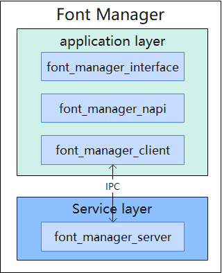

# Font Manager
## Introduction

The font management module provides the ability to install and uninstall fonts for system applications.

**Figure 1**   Architecture of the font management component



The font management component architecture is described as follows:

- Font management module, which provides third-party font installation and uninstallation interfaces for system applications.
- Font management Napi layer (font_manager_napi) is responsible for registering and converting ArkTS interfaces to C++ interfaces.
- The font management client (font_manager_client) interacts with the server for preliminary parameter check.
- The font management server (font_manager_server) interacts with the client, verifies permission, and installs and uninstalls font.
## Directory Structure

The directory structure of the fontmanager module is as follows:

```
/base/global/
├── font_manager            # Code repository for the Resmgr module
│   ├── frameworks          # Core code
│   │   ├── fontmgr         # Core code
│   │   │   ├── include     # Header files
│   │   │   ├── src         # Implementation code
│   │   │   └── test        # Test code
│   ├── interfaces          # APIs
│   │   └── js/kits         # ArkTS APIs
│   ├── sa_profile          # SystemAbility configuration files
│   ├── service             # client,server
│   │   └── include         # Header files
│   │   └── src             # Implementation code
```

## Constraints

**Development language**:ArkTS

## Repositories Involved

Globalization subsystem

global\_i18n\_standard

**global/font_manager**
