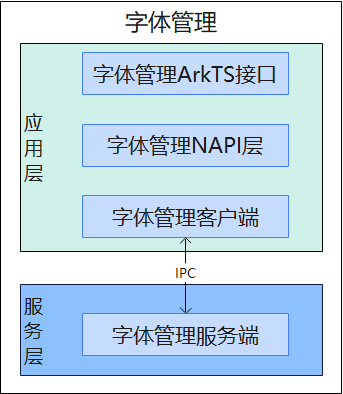

# 字体管理组件


## 简介

字体管理组件为系统应用提供了安装、卸载三方字体的能力。

**图 1**  字体管理组件架构图



字体管理组件架构图说明：

- 字体管理模块，面向系统应用提供安装与卸载三方字体接口。
- 字体管理Napi层（font_manager_napi）负责ArkTS接口到C++接口的注册与转换。
- 字体管理客户端（font_manager_client）负责与服务端交互，进行初步参数检查。
- 字体管理服务端（font_manager_server）负责与客户端进行交互，进行权限校验与字体的安装卸载。

## 目录

字体管理组件源代码目录结构如下所示：

```
/base/global/
├── font_manager            # 字体管理代码仓
│   ├── frameworks          # 字体管理核心代码
│   │   ├── fontmgr         # 字体管理核心代码
│   │   │   ├── include     # 字体管理头文件
│   │   │   ├── src         # 字体管理实现代码
│   │   │   └── test        # 字体管理测试代码
│   ├── interfaces          # 字体管理接口
│   │   └── js/kits         # 字体管理ArkTS接口
│   ├── sa_profile          # 字体管理SystemAbility配置文件定义目录
│   ├── service             # 字体管理服务端、客户端结构
│   │   └── include         # 字体管理服务端、客户端头文件
│   │   └── src             # 字体管理服务端、客户端实现代码
```

## 约束

**语言限制**：ArkTS语言

## 相关仓

全球化子系统

global\_i18n\_standard

**global/font_manager**
